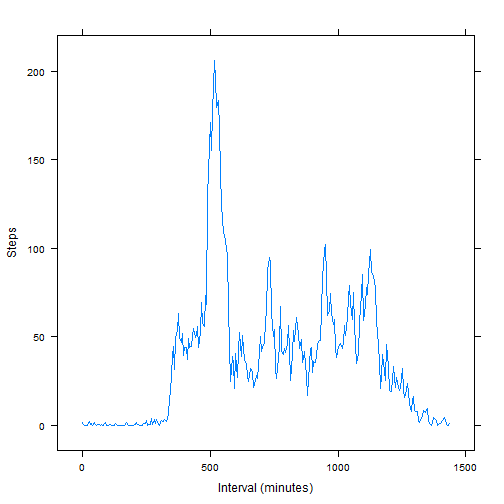

####This R markdown file was developed as part of the "Reproductible Research" course.  
The file will demonstrate  
1. My R coding skills  
2. Detailed documentation  
3. Good effort  


### Loading and processing the data
First we will load the data into R  
We will then convert the date column into a date class  


```r
dfActivity<-read.csv("d:/work/coursera/activity.csv",na.strings="NA",colClasses=c("numeric","character","numeric"))
dfActivity$date<-strptime(dfActivity$date,"%Y-%m-%d")

summary(dfActivity)
```

```
##      steps             date                        interval     
##  Min.   :  0.00   Min.   :2012-10-01 00:00:00   Min.   :   0.0  
##  1st Qu.:  0.00   1st Qu.:2012-10-16 00:00:00   1st Qu.: 588.8  
##  Median :  0.00   Median :2012-10-31 00:00:00   Median :1177.5  
##  Mean   : 37.38   Mean   :2012-10-31 00:25:34   Mean   :1177.5  
##  3rd Qu.: 12.00   3rd Qu.:2012-11-15 00:00:00   3rd Qu.:1766.2  
##  Max.   :806.00   Max.   :2012-11-30 00:00:00   Max.   :2355.0  
##  NA's   :2304
```

### What is mean total number of steps taken per day?
This code will calculate the steps per day using the tapply function. Then lay it out in a histogram.

```r
stepsPerDay<-tapply(dfActivity$steps,as.character(dfActivity$date),sum,rm.na=TRUE)
library(lattice)
histogram(stepsPerDay,col="blue")
```

 

Next we are going to find the mean and median

```r
medianSteps<-median(stepsPerDay,na.rm=TRUE)
meanSteps<-mean(stepsPerDay,na.rm=TRUE)
```

- The median step count is *10766*.  
- The mean step count is *10767.19*.  

### What is the average daily activity pattern?
We will calculate the daily activity by the time series.  
We will then generate a time plot to show the average activity.
We are converting the interval format from hours and minutes to minutes.  
The reason for converting the interval is that it creates a big space in the chart at the bottom of the hour for example between 1055 (representing 10:55) and 1100

```r
avgStepsPerTimeSeries<-tapply(dfActivity$steps,dfActivity$interval,mean,na.rm=TRUE)
minutes<-as.numeric(names(avgStepsPerTimeSeries))%/%100*60+as.numeric(names(avgStepsPerTimeSeries))%%100
xyplot(avgStepsPerTimeSeries~minutes,type="l",ylab="Steps",xlab="Interval (minutes)")
```

 

The maximum activity in the day is in the 835 interval.  
The maximum step count is 206.1698.

### Imputing missing values
The data file has 2304 observations with NA steps out of 17568 observations.  
We will use the average for the interval to imput an alternative value.  

```r
steps2<-numeric(0)
for (i in 1:length(dfActivity$steps)) {
  if (is.na(dfActivity$steps[i])) {
    steps2[i]<-(avgStepsPerTimeSeries[as.character(dfActivity$interval[i])])
    } else {
    steps2[i]<-dfActivity$steps[i]
  }
  }
dfActivity$steps2<-steps2

stepsPerDay2<-tapply(dfActivity$steps2,as.character(dfActivity$date),sum,rm.na=FALSE)
histogram(stepsPerDay2,col="blue")
```

 
Next we are going to find the mean and median

```r
medianSteps2<-median(stepsPerDay2,na.rm=FALSE)
meanSteps2<-mean(stepsPerDay2,na.rm=FALSE)
```
After removing the "NA"" values:  
- The new median step count is *10766.19*.  
- The new mean step count is *10766.19*.

### Are there differences in activity patterns between weekdays and weekends?
We will now plot the data split between weekends and weekdays.
First we are checking each of the date for weekend/weekday and populating a vector with the results, the vector will be added to the data frame.

```r
weekend<-character(0)
for (dayofweek in weekdays(dfActivity$date)) 
  weekend<-c(weekend,if (dayofweek=='Saturday'|dayofweek=='Sunday') "Weekend" else "Weekday")
dfActivity$weekend<-weekend
```

Next we will create a new data frame and add the means for weekend and weekday activity.


```r
weAvg<-tapply(dfActivity$steps2[dfActivity$weekend=="Weekend"],dfActivity$interval[dfActivity$weekend=="Weekend"],mean)
weMinutes<-as.numeric(names(avgStepsPerTimeSeries))%/%100*60+as.numeric(names(avgStepsPerTimeSeries))%%100
wdAvg<-tapply(dfActivity$steps2[dfActivity$weekend=="Weekday"],dfActivity$interval[dfActivity$weekend=="Weekday"],mean)
wdMinutes<-as.numeric(names(avgStepsPerTimeSeries))%/%100*60+as.numeric(names(avgStepsPerTimeSeries))%%100
dfWeekendMean<-data.frame(Interval=c(weMinutes,wdMinutes),AvgSteps=c(weAvg,wdAvg))
dfWeekendMean$Weekend<-c(rep("Weekend",length(weMinutes)),rep("Weekday",length(wdMinutes)))
with(dfWeekendMean,xyplot(AvgSteps~Interval|Weekend,layout=c(1,2),ylab="Number of Steps",type="l"))
```

 


